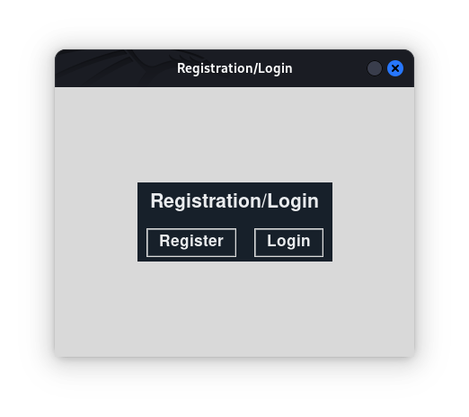
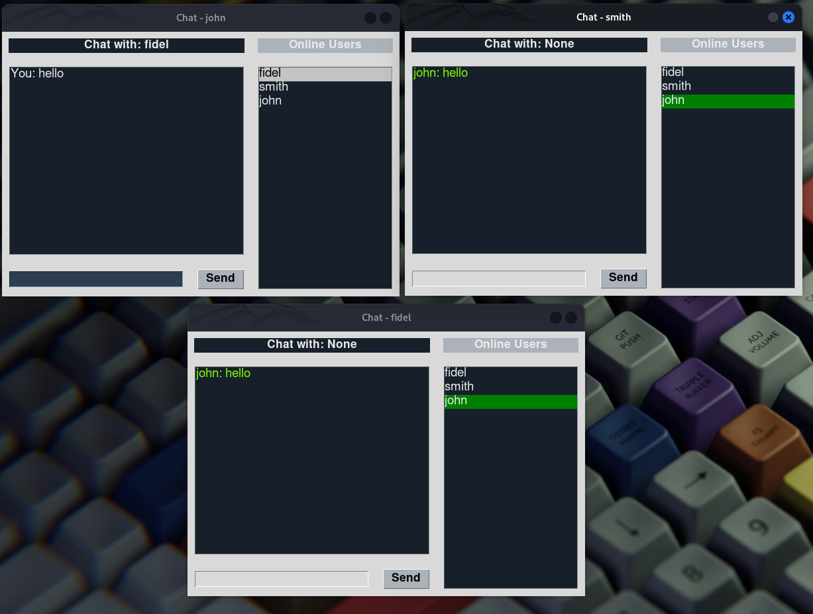

# PythonChat

PythonChat is a simple chat server implemented in Python. It includes both server and client scripts that enable multiple users to communicate in real-time.

## Features
- Multi-client support
- Real-time messaging
- Easy setup and usage

## Installation
```bash
git clone https://github.com/phantom-kali/PythonChat.git
cd PythonChat
```


 ```bash
 pip install -r requirements.txt
 ```

### Usage

#### Starting the Server
To start the chat server, run the following command:
```bash
python server.py
```

Starting the Client
To connect to the chat server, run the following command:
```bash
python client.py
```

### Screenshots

#### Registration/Login


#### Chat Window


